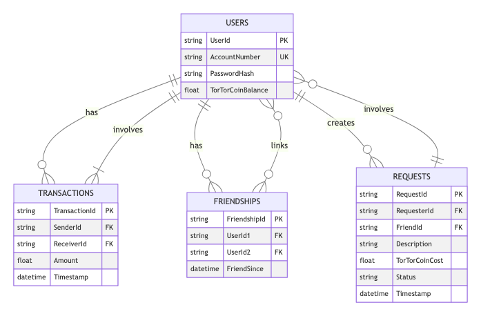

### Users Table
- **UserId** (Primary Key): Unique identifier for the user.
- **AccountNumber**: Unique account number for the user.
- **PasswordHash**: Hashed password for security.
- **TorTorCoinBalance**: Balance of TorTorCoins the user has.

### Transactions Table
- **TransactionId** (Primary Key): Unique identifier for the transaction.
- **SenderId**: UserId of the sender.
- **ReceiverId**: UserId of the receiver.
- **Amount**: Amount of TorTorCoins transferred.
- **Timestamp**: Date and time of the transaction.

### Friendships Table
- **FriendshipId** (Primary Key): Unique identifier for the friendship.
- **UserId1**: UserId of the first user.
- **UserId2**: UserId of the second user.
- **FriendSince**: Date and time when the friendship was established.

### Requests Table
- **RequestId** (Primary Key): Unique identifier for the request.
- **RequesterId**: UserId of the requester.
- **FriendId**: UserId of the friend who is requested for assistance.
- **Description**: Description of the assistance requested.
- **TorTorCoinCost**: Cost in TorTorCoins for the request.
- **Status**: Status of the request (e.g., Pending, Completed).
- **Timestamp**: Date and time when the request was made.

### Indices and Relationships
- Indices on foreign keys (UserId, SenderId, ReceiverId, RequesterId, FriendId) for faster lookups.
- Relationships:
    - Users to Transactions (one-to-many): A user can have multiple transactions.
    - Users to Friendships (many-to-many): Users can have multiple friendships.
    - Users to Requests (one-to-many): A user can create multiple requests.